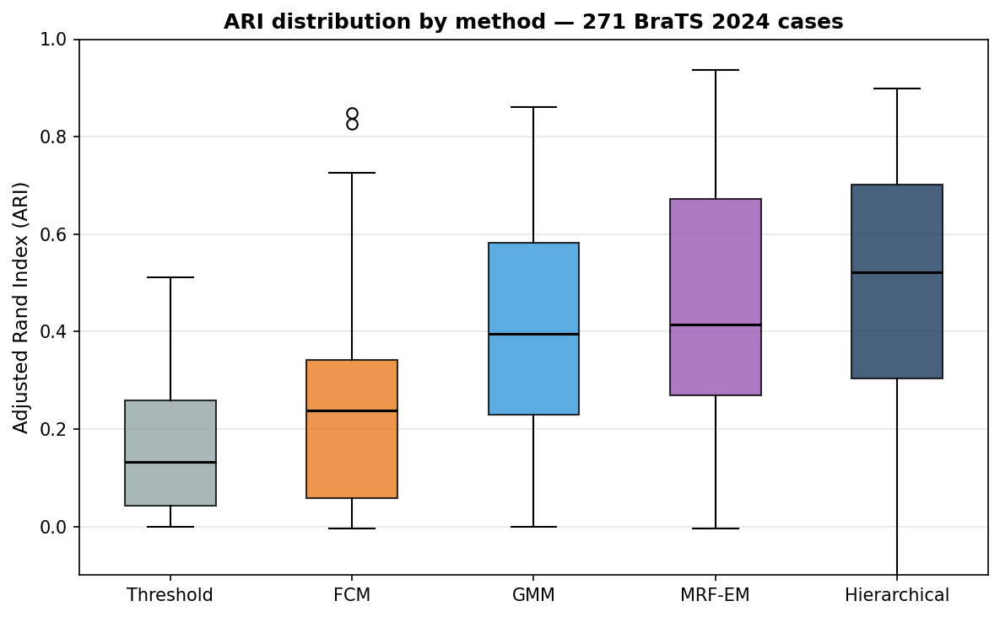

<div align="center">


# GlioCore

### Metabolic Glioma Segmentation from PET/MRI

[](https://www.python.org/)
[](https://napari.org/)
[](LICENSE)
[]()
[]()

**An open-source Python tool for semi-automatic glioma segmentation from co-registered PET and MRI, combining six clustering models, a white-matter atlas, active learning, and a novel hierarchical method validated on BraTS 2024.**

[Features](#features) · [Installation](#installation) · [Quick Start](#quick-start) · [Methods](#methods) · [Benchmark](#benchmark-results) · [Reproducibility](#reproducibility) · [Citation](#citation)

</div>

---

## Overview

Gliomas are the most common primary brain tumors, and their accurate delineation into metabolically distinct subregions is critical for treatment planning and monitoring. Standard MRI-based tools cannot exploit the metabolic information available in PET imaging, where SUV/SUVR values distinguish hypometabolic necrosis from hypermetabolic active infiltration.

**GlioCore** is, to our knowledge, the only open-source tool that combines:

- **Metabolic segmentation** on SUV/SUVR from co-registered PET + T1
- **Six clustering algorithms** compared on identical data, including a **novel hierarchical method**
- **JHU white-matter atlas** integration to quantify tract involvement per subregion
- **Active learning** that improves segmentation from expert corrections
- **Three explicit imaging modalities**: PET, MRI, and hybrid PET+MRI
- **Multi-channel segmentation**: clustering runs jointly on all available channels at once (T1, T1ce, T2, FLAIR in MRI; up to six channels in PET+MRI), automatically adapting to the channels present — not on a single intensity map

The clustering algorithms are quantitatively validated on the public **BraTS 2024** dataset, with paired statistical testing; the metabolic PET workflow is demonstrated qualitatively on real patient data, and quantitative PET validation is the planned next step.

---

## Features

| Module | Description |
|--------|-------------|
| **Segmentation** | GMM, Fuzzy C-Means, Level Set, MRF-EM, DBSCAN, and a novel Hierarchical method |
| **Cluster validation** | Modality-aware suite: Silhouette, Calinski-Harabasz, Davies-Bouldin, BIC/AIC, Elbow, bootstrap stability |
| **White-matter atlas** | JHU-ICBM 48 tracts, MNI152 registration via ANTsPy, per-subregion analysis |
| **Manual correction** | napari-based editing with structured storage for active learning |
| **Active learning** | Random Forest retrained incrementally on expert corrections |
| **AI agents** | Literature search and clinical report drafting (Claude API) |
| **Multi-modality** | Automatic detection of PET / MRI / PET+MRI from available files |

---

## Benchmark Results

Validation on the **full 271-case** `training_data_additional` subset of BraTS 2024, in MRI mode using all four contrasts (T1, T1ce, T2, FLAIR).

| Method | ARI [95% CI] | Dice ET [95% CI] | Runtime |
|--------|------|---------|---------|
| Threshold (baseline) | 0.13 [0.11–0.15] | 0.55 [0.49–0.61] | 1.6 s |
| FCM | 0.24 [0.21–0.27] | 0.38 [0.32–0.43] | 4.3 s |
| GMM | 0.40 [0.36–0.42] | **0.74** [0.67–0.76] | 8 s |
| MRF-EM | 0.41 [0.37–0.46] | 0.73 [0.67–0.77] | 73 s |
| **Hierarchical** | **0.52** [0.48–0.56] | 0.66 [0.59–0.72] | **4.4 s** |

*Medians across 271 cases (ARI) and 233 cases where the region exists in the ground truth (Dice). ARI = Adjusted Rand Index (structural agreement); Dice ET = Dice on the enhancing tumor.*



**A characterized trade-off, not a single winner.** No method dominates across all metrics:

- **Structural agreement (ARI):** the proposed **Hierarchical** method leads (0.52). A paired Wilcoxon test shows its advantage over Threshold, FCM and GMM is significant (p < 0.000001), while versus **MRF-EM it is *not* significant** (p = 0.082, Cliff's δ = 0.02) — the two are statistically equivalent, but Hierarchical runs ~17× faster (4.4 vs 73 s/case).
- **Enhancing tumor (Dice ET):** **GMM and MRF-EM lead** (≈0.73), ahead of Hierarchical (0.66).
- **Tumor Core:** low for *all* methods (0.28–0.41), reflecting necrosis/edema signal overlap on structural MRI.
- **Baseline:** the threshold floor (ARI 0.13) confirms clustering adds substantial value.

The method to choose depends on the goal: global structural agreement and efficiency → Hierarchical; maximum enhancing-tumor precision → GMM. Claims are scoped to MRI clustering validation, reported as *best among the methods tested*, not absolute superiority.

### Methodological rigor

These numbers are deliberately conservative and fully reproducible:

- **No metric overfitting.** The cluster-to-region mapping is fixed *a priori* by intensity order (enhancing = highest-intensity cluster), never optimized against the ground truth.
- **Segmentation operates inside the provided tumor mask** (`seg > 0`); we evaluate *subregion partitioning*, not tumor detection. Whole-tumor Dice is ~1 by construction and excluded.
- **Tumor Core Dice is low for *all* methods tested**, a property of the MRI signal (necrosis/edema overlap), not of a specific algorithm. GlioCore addresses it via metabolic PET segmentation and active learning.
- **Inductive bias disclosed.** The Hierarchical method is designed around a tissue hierarchy mirroring the BraTS label structure, giving it a favourable bias on the ARI metric; its advantage is expected to narrow on partitions of a different nature.
- Regions are evaluated only on cases where they exist in the ground truth.

For full methodology, see the [Methods Guide](docs/GlioCore_Methods_Guide_EN.docx) and the [Validation Report](docs/GlioCore_Validation_Report_EN.docx).

---

## Installation

### 1. Create the environment

```bash
conda create -n gliocore python=3.11 -y
conda activate gliocore
```

### 2. Install dependencies

```bash
pip install "napari[all]" PyQt6
pip install nibabel numpy scipy SimpleITK
pip install scikit-learn scikit-image scikit-fuzzy
pip install anthropic httpx sqlalchemy openpyxl matplotlib
```

### 3. Optional — faster OpenGL rendering

```bash
pip install PyOpenGL-accelerate
```

This is an **optional** acceleration module. If the installation fails (it requires C build tools on Windows), simply skip it: GlioCore runs normally without it. The message `No OpenGL_accelerate module loaded` at startup is informational and can be ignored.

### 4. Optional — white-matter atlas (ANTsPy, ~1 GB)

```bash
pip install antspyx
```

Place `MNI152_T1_1mm.nii.gz` and `JHU-ICBM-labels-1mm.nii.gz` in `data/atlas/`. Both are available from the [FSL atlases](https://fsl.fmrib.ox.ac.uk/fsl/fslwiki/Atlases).

---

## Quick Start

### Patient data layout

GlioCore auto-detects the modality from the files present in each patient folder.

**PET** (metabolic workflow):
```
data/patients/PAZ001/
├── SUVR_2_T1_cerebWM.nii      ← SUVR co-registered to T1
├── SUV_2_T1.nii               ← SUV co-registered to T1
├── tumour_mask_4t.nii         ← tumor mask
└── T1.nii                     ← anatomical T1 (optional)
```

**MRI** (BraTS-style, for benchmarking):
```
data/patients/BraTS-GLI-XXXXX/
├── *-t1n.nii.gz   *-t1c.nii.gz
├── *-t2w.nii.gz   *-t2f.nii.gz
└── *-seg.nii.gz   ← ground truth
```

Both `.nii` and `.nii.gz` are supported.

### Launch

```bash
cd gliocore
python app.py
```

### Recommended workflow

The interface is organized into tabs, to be used in order:

1. **Validate k** — load a patient, run cluster-number validation, inspect the diagnostic plots
2. **Segmentation** — run the chosen model, view the clusters in napari
3. **Atlas WM** *(optional)* — register to MNI152, compute tract overlap per subregion
4. **Correction** *(optional)* — refine the segmentation; corrections feed active learning
5. **Validate BraTS** — quantitative benchmarking against ground truth

---

## Reproducibility

All benchmark numbers in this repository are fully reproducible. To obtain the exact values reported above, run the **Validate BraTS** tab with the following parameters, identical for every method:

| Parameter | Value |
|-----------|-------|
| Dataset | BraTS 2024 `training_data_additional` (271 cases) |
| Modality | MRI (T1, T1ce, T2, FLAIR) |
| **Number of clusters (k)** | **k = 3** for all methods (k min = 3, k max = 3) |
| Hierarchical parameters | `primary_weight = 1.5`, `n_level1 = 2`, `split_mode = active_only` (defaults) |
| Cluster→region mapping | a priori, by intensity order (no ground-truth optimization) |
| Subregions | TC/ET computed only where present in the ground truth |
| Confidence intervals | bootstrap, 10,000 resamples |

**Important:** the `k = 3` setting is essential to reproduce the results. With a different k (e.g. automatic BIC selection that may return k = 4), the GMM and FCM partitions change and the metrics will differ. The Hierarchical method is deterministic and returns identical values across runs with the same parameters.

The per-case result tables for all five methods are provided in `docs/results/` as Excel files, so any value can be independently verified.

---

## Methods

All models operate on a feature matrix built from the available channels of the detected modality. Clusters are ordered by a configurable primary feature (SUVR for PET, T1ce for MRI).

| Model | Type | Reference |
|-------|------|-----------|
| **GMM** | Gaussian Mixture, BIC/AIC model selection | Zhao et al. (2021) |
| **FCM** | Fuzzy C-Means, soft membership | Bezdek (1981) |
| **Level Set** | Chan-Vese contour evolution | Chan & Vese (2001) |
| **MRF-EM** | GMM + Ising spatial prior (ICM) | Zhang et al. (2001) |
| **DBSCAN** | Density-based, adaptive ε | Ester et al. (1996) |
| **Hierarchical** | Two-level intensity-hierarchical clustering | *This work* |
| **Threshold** | Quantile thresholding (baseline) | — |

### The Hierarchical method

The novel contribution of GlioCore. Instead of flat *k*-clustering, it proceeds in two biologically-motivated levels: it first separates metabolically inactive tissue (necrosis) from active tissue, then subdivides only the active region into edema and enhancement. This produces ~3 clusters mapping to the BraTS subregion hierarchy, is robust to subregion imbalance, and runs in ~4.4 s per case.

### How metrics are computed

- **Dice** = 2|P∩G| / (|P|+|G|), measuring overlap between prediction P and ground truth G.
- **Jaccard** = |P∩G| / |P∪G|.
- **HD95** = 95th percentile of the bidirectional surface distance (robust to outliers).
- **ARI** (Adjusted Rand Index) = chance-corrected agreement between the model partition and BraTS classes; invariant to label permutation, and computed *without* using the ground truth to choose the cluster mapping.

Full derivations and design rationale are in the [Methods Guide](docs/GlioCore_Methods_Guide_EN.docx).

---

## Project Structure

```
gliocore/
├── app.py
├── config/settings.py
├── io_data/
│   ├── loader.py          # multi-modal NIfTI loader
│   └── modality.py        # Modality, FeatureSet, feature builder
├── segmentation/
│   ├── base.py            # model interface (fit on FeatureSet + context)
│   ├── gmm.py  fuzzy_cmeans.py  level_set.py
│   ├── mrf_em.py  dbscan.py  hierarchical.py
│   ├── threshold_baseline.py
│   ├── bayesian_rf.py     # active-learning model
│   ├── validation.py      # modality-aware k selection
│   └── registry.py
├── validation/
│   └── brats_benchmark.py # BraTS validation (a-priori mapping)
├── atlas/                 # MNI registration + JHU overlap
├── agents/                # Claude API agents
├── learning/              # SQLite session database
├── ui/                    # napari panels
├── docs/                  # documentation, figures, logo, results
└── data/
    ├── patients/  output/  atlas/
```

### The `docs/` folder

The `docs/` folder contains all supporting material:

```
docs/
├── logo.svg                              # project logo
├── GlioCore_Methods_Guide_EN.docx        # technical methods guide
├── GlioCore_Validation_Report_EN.docx    # full validation report
├── fig1_ari_boxplot_EN.png               # ARI distribution
├── fig2_metrics_ci_EN.png                # metrics with confidence intervals
├── fig3_accuracy_runtime_EN.png          # accuracy vs runtime
└── results/                              # per-case benchmark tables (Excel)
    ├── brats_MRI_Threshold.xlsx
    ├── brats_MRI_FCM.xlsx
    ├── brats_MRI_GMM.xlsx
    ├── brats_MRI_MRF-EM.xlsx
    └── brats_MRI_Hierarchical.xlsx
```

---

## Limitations

- Quantitative validation covers the **MRI clustering** algorithms (BraTS). The **PET metabolic** workflow is demonstrated qualitatively; quantitative PET validation requires expert manual masks and is future work.
- On structural MRI, necrosis and edema are hard to separate for **any** unsupervised method (a signal limitation, confirmed by the similar results across all methods). GlioCore addresses this through metabolic PET segmentation and active learning.
- The **PET+MRI hybrid mode** is implemented and operational, but its quantitative validation awaits cohorts with co-registered PET and multi-contrast MRI plus expert annotation (rare datasets).
- GlioCore is a **research tool**, not a certified medical device.

---

## Citation

```bibtex
@software{manca2026gliocore,
  author  = {Manca, Jonathan},
  title   = {GlioCore: Metabolic Glioma Segmentation from PET/MRI},
  year    = {2026},
  url     = {https://github.com/jonathan-manca/gliocore},
  license = {MIT}
}
```

### Key references

- Zhao B. et al. (2021). *AUCseg: an automatically unsupervised clustering toolbox for 3D-segmentation of high-grade gliomas.* Frontiers in Oncology. DOI: 10.3389/fonc.2021.679952
- Zhang Y. et al. (2001). *Segmentation of brain MR images through a hidden Markov random field model.* IEEE TMI. DOI: 10.1109/42.906424
- Chan T.F. & Vese L.A. (2001). *Active contours without edges.* IEEE TIP. DOI: 10.1109/83.902291
- Hua K. et al. (2008). *Tract probability maps in stereotaxic spaces.* NeuroImage. DOI: 10.1016/j.neuroimage.2007.07.053
- Menze B.H. et al. (2015). *The Multimodal Brain Tumor Image Segmentation Benchmark (BRATS).* IEEE TMI. DOI: 10.1109/TMI.2014.2377694
- Hubert L. & Arabie P. (1985). *Comparing partitions.* Journal of Classification. DOI: 10.1007/BF01908075
- Wilcoxon F. (1945). *Individual comparisons by ranking methods.* Biometrics Bulletin. DOI: 10.2307/3001968

---

## Disclaimer

> GlioCore is intended for **research purposes only**. It is not a certified medical device and must not be used for clinical decision-making without qualified medical supervision.

---

## Author

**Jonathan Manca** — Independent researcher, neuro-oncology imaging
[](https://www.linkedin.com/in/jonathan-manca)

<div align="center">
<sub>MIT License · 2026 · Jonathan Manca</sub>
</div>
